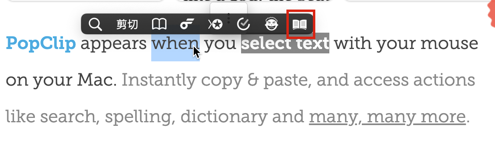
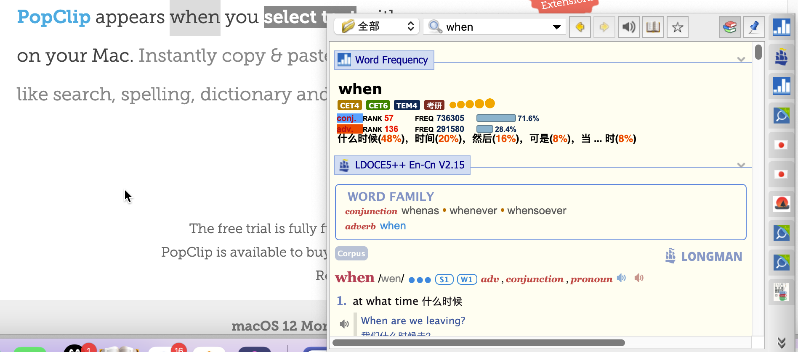

# Goldendict PopClip Extension

## 功能

本插件主要用于快捷调用==mac==版本 Goldendict，点击之后即可立即翻译

## 网页链接

* mac版本 Goldendict 下载地址 [GoldenDict - Browse /early access builds at SourceForge.net](https://sourceforge.net/projects/goldendict/files/early%20access%20builds/)
* PopClip 下载地址[PopClip for Mac (pilotmoon.com)](https://pilotmoon.com/popclip/)

## 特别鸣谢

Bob提供的Bob PopClip Extension，本插件由Bob PopClip Extension改写而来。

- 相关链接[PopClip 调用 | Bob (bobtranslate.com)](https://bobtranslate.com/guide/integration/popclip.html)

